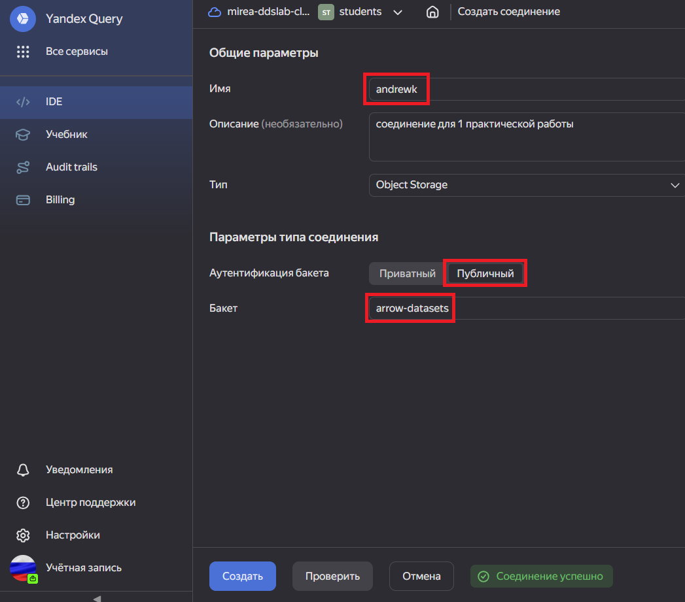
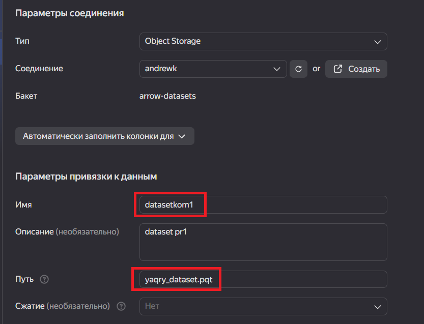
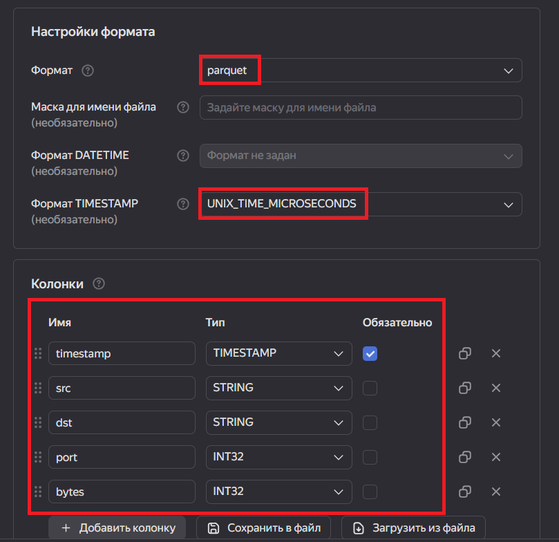
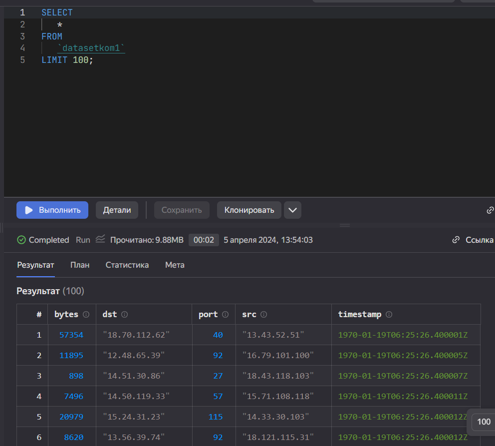

Практическая работа 1
================

## Цель работы

1.  Изучить возможности технологии Yandex Query для анализа
    структурированных наборов данных
2.  Получить навыки построения аналитического пайплайна для анализа
    данных с помощью сервисов Yandex Cloud
3.  Закрепить практические навыки использования SQL для анализа данных
    сетевой активности в сегментированной корпоративной сети

## Исходные данные

1.  ОС Windows
2.  Cервисы Yandex Cloud
3.  RStudio

## План

1.  Проверить доступность данных в Yandex Object Storage
2.  Подключить бакет как источник данных для Yandex Query
3.  Провести анализ данных
4.  Создать отчет

## Описание шагов:

1.  **Проверьте доступность данных** (файл yaqry_dataset.pqt) в бакете
    arrow-datasets S3 хранилища Yandex Object Storage. Проверить можно
    просто перейдя по правильно сконструированному URL в браузере.

    <https://storage.yandexcloud.net/arrow-datasets/yaqry_dataset.pqt>

2.  **Подключить бакет как источник данных для Yandex Query**

Yandex Query – это облачное решение для анализа данных, в котором задачи
организации хранения, обеспечения доступа и выполнения первичного
анализа данных полностью берет на себя сервис-провайдер, то есть Yandex
Cloud.

-   Войдем в свой аккаунт и подключимся к Yandex Cloud


-   Создадим соединение для бакета в S3 хранилище.

-   Заполняем поля с учетом допустимых символов, выбираем тип
    аутентификации. Вводим имя бакета в соответствующее поле и
    сохраняем.

    

-   Настроем привязку данных

    

-   Опишем состав и формат входных данных

    

Формат данных  
SCHEMA=( timestamp TIMESTAMP NOT NULL, src STRING, dst STRING, port
INT32, bytes INT32 )

-   Если настройки сделаны правильно, то можно попробовать сделать
    аналитический запрос и посмотреть результат



1.  **Провести анализ данных**

1\. Известно, что IP адреса внутренней сети начинаются с октетов,
принадлежащих интервалу \[12-14\]. Определите количество хостов
внутренней сети, представленных в датасете.

2\. Определите суммарный объем исходящего трафика

3\. Определите суммарный объем входящего трафика

``` r
5+7
```

    [1] 12

    Hi

``` r
x<-5+7
x
```

    [1] 12

1.  Создадим отчет в RSTUDIO

## Оценка результатов

Задача выполнена при помощи облачных сервисов Yandex Cloud и технологии
Yandex Query, удалось познакомится с их функционалом и особенностями.

## Вывод

В данной работе я смог закрепить практические навыки использования SQL
для анализа данных сетевой активности в сегментированной корпоративной
сети и получить навыки построения аналитического пайплайна для анализа
данных
