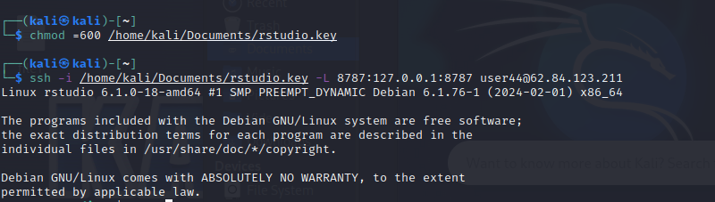
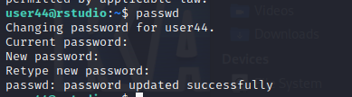
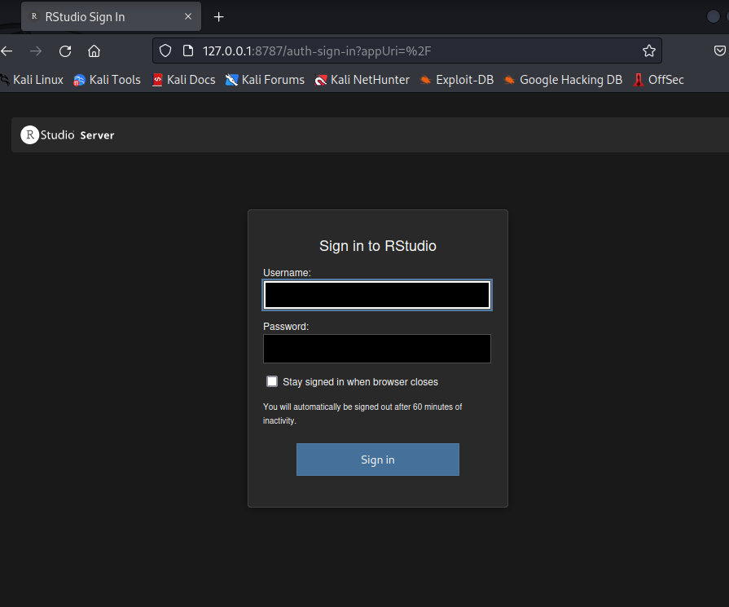
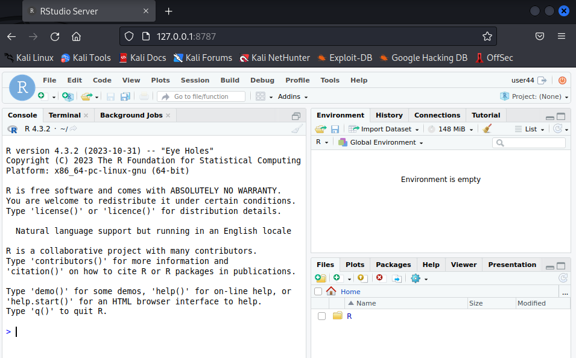

# Практическая работа 3

## Цель работы

1.  Изучить возможности технологии Apache Arrow для обработки и анализ
    больших данных
2.  Получить навыки применения Arrow совместно с языком программирования
    R
3.  Получить навыки анализа метаинфомации о сетевом трафике
4.  Получить навыки применения облачных технологий хранения, подготовки
    и анализа данных: Yandex Object Storage, Rstudio Server

## Исходные данные

1.  ОС Kali linux
2.  Apache Arrow
3.  RStudio
4.  Yandex Object Storage

## План

1.  Выполним вход по ssh в RSTUDIO под нашим user
2.  Выполним практическое задание
3.  Составим отчет

## Описание шагов:

1.  *Выполним вход по ssh в RSTUDIO под нашим user (44)*

    Меняем права на файле

    Выполняем вход по ssh

    

    Меняем пароль у user

    

    Заходим в Rstudio Server под своим аккаунтом

    

    

    Связываем существующий репозиторий гит с данной системой через
    Personal access tokens

    

2.  Выполним практические задания

``` r
library(arrow, warn.conflicts = FALSE)
```

    Some features are not enabled in this build of Arrow. Run `arrow_info()` for more information.

``` r
library(tidyverse, warn.conflicts = FALSE)
```

    ── Attaching core tidyverse packages ──────────────────────── tidyverse 2.0.0 ──
    ✔ dplyr     1.1.4     ✔ readr     2.1.5
    ✔ forcats   1.0.0     ✔ stringr   1.5.1
    ✔ ggplot2   3.4.4     ✔ tibble    3.2.1
    ✔ lubridate 1.9.3     ✔ tidyr     1.3.1
    ✔ purrr     1.0.2     

    ── Conflicts ────────────────────────────────────────── tidyverse_conflicts() ──
    ✖ lubridate::duration() masks arrow::duration()
    ✖ dplyr::filter()       masks stats::filter()
    ✖ dplyr::lag()          masks stats::lag()
    ℹ Use the conflicted package (<http://conflicted.r-lib.org/>) to force all conflicts to become errors

### Задание 1: Найдите утечку данных из Вашей сети

Важнейшие документы с результатами нашей исследовательской деятельности
в области создания вакцин скачиваются в виде больших заархивированных
дампов. Один из хостов в нашей сети используется для пересылки этой
информации – он пересылает гораздо больше информации на внешние ресурсы
в Интернете, чем остальные компьютеры нашей сети. Определите его
IP-адрес

``` r
dir.create("data", showWarnings = FALSE)

curl::multi_download(
  "https://storage.yandexcloud.net/arrow-datasets/tm_data.pqt",
  "data/testdata",
  resume = TRUE
)
```

    # A tibble: 1 × 10
      success status_code resumefrom url    destfile error type  modified
      <lgl>         <int>      <dbl> <chr>  <chr>    <chr> <chr> <dttm>  
    1 TRUE            416          0 https… /home/u… <NA>  appl… NA      
    # ℹ 2 more variables: time <dbl>, headers <list>

``` r
dt <- open_dataset(
  sources = "data/testdata",
  schema = schema(timestamp=int64(),src=utf8(),dst=utf8(),port=uint32(),bytes=uint32())
)
glimpse(dt) 
```

    FileSystemDataset with 1 Parquet file
    105,747,730 rows x 5 columns
    $ timestamp <int64> 1578326400001, 1578326400005, 1578326400007, 1578326400011, …
    $ src      <string> "13.43.52.51", "16.79.101.100", "18.43.118.103", "15.71.108.…
    $ dst      <string> "18.70.112.62", "12.48.65.39", "14.51.30.86", "14.50.119.33"…
    $ port     <uint32> 40, 92, 27, 57, 115, 92, 65, 123, 79, 72, 123, 123, 22, 118,…
    $ bytes    <uint32> 57354, 11895, 898, 7496, 20979, 8620, 46033, 1500, 979, 1036…

``` r
z1 <- dt %>%
  filter(str_detect(src, "^12.") | str_detect(src, "^13.") | str_detect(src, "^14."))  %>%
  filter(!str_detect(dst, "^12.") | !str_detect(dst, "^13.") | !str_detect(dst, "^14."))  %>%
  group_by(src) %>% summarise("sum" = sum(bytes)) %>%  
  filter(sum>6000000000) %>% select(src,sum) 
z1 |> collect()
```

    # A tibble: 1 × 2
      src                  sum
      <chr>              <dbl>
    1 13.37.84.125 11152202376

Ответ  
13.37.84.125

### Задание 2: Найдите утечку данных 2

Другой атакующий установил автоматическую задачу в системном
планировщике cron для экспорта содержимого внутренней wiki системы. Эта
система генерирует большое количество трафика в нерабочие часы, больше
чем остальные хосты. Определите IP этой системы. Известно, что ее IP
адрес отличается от нарушителя из предыдущей задачи

``` r
z2 <- dt %>%
      select(timestamp, src, dst, bytes) %>%
      mutate(trafic = (str_detect(src, "^((12|13|14)\\.)") & !str_detect(dst, "^((12|13|14)\\.)")),time = hour(as_datetime(timestamp/1000))) %>%
      filter(trafic == TRUE, time >= 0 & time <= 24) %>% group_by(time) %>%
      summarise(trafictime = n()) %>% arrange(desc(trafictime))
z2 |> collect()
```

    # A tibble: 24 × 2
        time trafictime
       <int>      <int>
     1    16    4490576
     2    22    4489703
     3    18    4489386
     4    23    4488093
     5    19    4487345
     6    21    4487109
     7    17    4483578
     8    20    4482712
     9    13     169617
    10     7     169241
    # ℹ 14 more rows

Определяем рабочие часы:  
Учитывая нагрузку на трафик, рабочее время: 16:00-24:00

``` r
z2_2 <- dt %>% mutate(time = hour(as_datetime(timestamp/1000))) %>% 
  filter(!str_detect(src, "^13.37.84.125")) %>% 
  filter(str_detect(src, "^12.") | str_detect(src, "^13.") | str_detect(src, "^14."))  %>%
  filter(!str_detect(dst, "^12.") | !str_detect(dst, "^13.") | !str_detect(dst, "^14."))  %>%
  filter(time >= 1 & time <= 15) %>% 
  group_by(src) %>% summarise("sum" = sum(bytes)) %>%
  filter(sum>290000000) %>% select(src,sum) 
z2_2 |> collect()
```

    # A tibble: 1 × 2
      src               sum
      <chr>           <int>
    1 12.55.77.96 298669501

Ответ  
12.55.77.96

### Задание 3: Найдите утечку данных 3

Еще один нарушитель собирает содержимое электронной почты и отправляет в
Интернет используя порт, который обычно используется для другого типа
трафика. Атакующий пересылает большое количество информации используя
этот порт,которое нехарактерно для других хостов, использующих этот
номер порта. Определите IP этой системы. Известно, что ее IP адрес
отличается от нарушителей из предыдущих задач

``` r
z3 <- dt %>% filter(!str_detect(src, "^13.37.84.125")) %>% 
  filter(!str_detect(src, "^12.55.77.96")) %>% 
  filter(str_detect(src, "^12.") | str_detect(src, "^13.") | str_detect(src, "^14."))  %>%
  filter(!str_detect(dst, "^12.") | !str_detect(dst, "^13.") | !str_detect(dst, "^14."))  %>% select(src, bytes, port) 


z3_1 <-z3 %>%  group_by(port) %>% summarise("mean"=mean(bytes), "max"=max(bytes), "sum" = sum(bytes)) %>% 
  mutate("Raz"= max-mean)  %>% filter(Raz!=0, Raz>170000)

z3_1 |> collect()
```

    # A tibble: 1 × 5
       port   mean    max         sum     Raz
      <int>  <dbl>  <int>       <dbl>   <dbl>
    1    37 33348. 209402 48192673159 176054.

``` r
z3_2 <- z3  %>% filter(port==37) %>% group_by(src) %>% 
  summarise("mean"=mean(bytes)) %>% filter(mean>37543) %>% select(src)
z3_2 |> collect()
```

    # A tibble: 1 × 1
      src        
      <chr>      
    1 13.46.35.35

Ответ  
13.46.35.35

## Оценка результатов

Задача выполнена при помощи облачных технологий, приложения RStudio и
Apache Arrow, удалось познакомится с функционалом Arrow и при его помощи
удалось выполнить задание.

## Вывод

В данной работе я смог познакомиться с применением облачных технологий
хранения, подготовки и анализа данных. Удалось проанализировать
метаинформацию о сетевом трафике.
